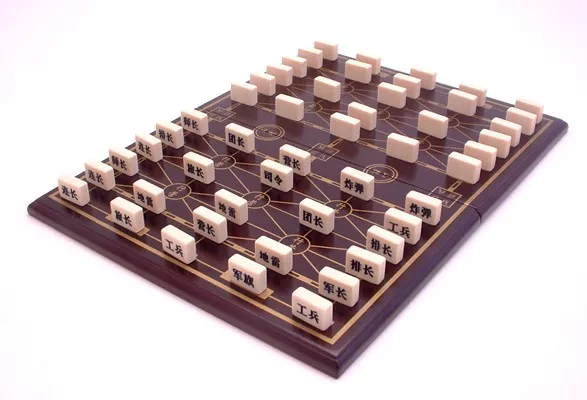
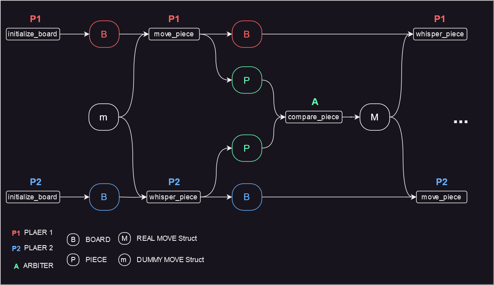

- [Summary](#summary)
- [Game Flow](#game-flow)

# Summary
Land Battle Chess is a two-player Chinese board game. It is an abstract strategy game of incomplete information, since each player has only limited knowledge concerning the disposition of the opposing pieces.
The rules are complicated; for more details, please refer to [Wikipedia](https://en.wikipedia.org/wiki/Luzhanqi). 

In the game, there are 3 parties: player1, player2 and the arbiter. When a piece lands on a space occupied by an opposing piece, the arbiter is responsible for comparing pieces. The lower-ordered piece is removed from the board; if the two are of equal order, both are to be removed from the board.

# Game Flow

See ./run.sh for an example.

1. Both Players Initialize their Board
2. Player1 Moves a piece
3. Player2 Whispers the Arbiter the Target Piece
4. Aribter Compares pieces
5. Player2 Moves a piece
6. Player1 Whispers the Arbiter the Target Piece
7. Aribter Compares pieces
8. Continue until Game Ends
